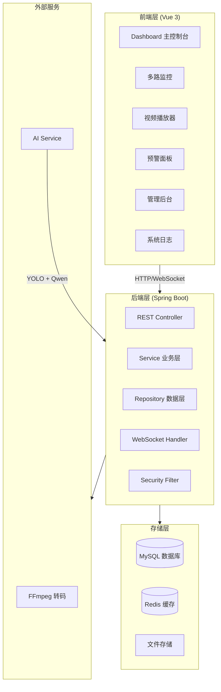
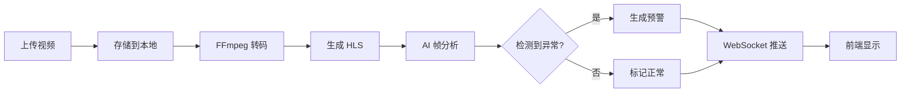
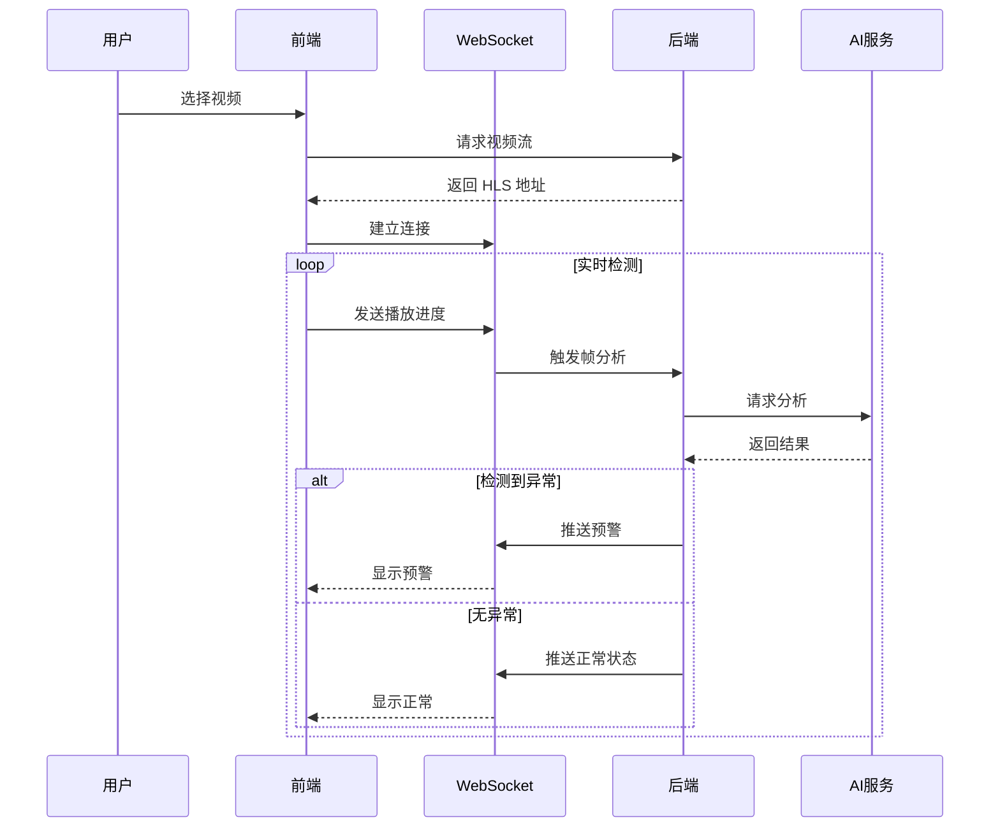
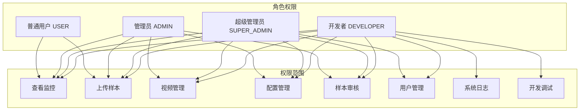

# 智能安全监控系统

<div align="center">


基于 AI 的全栈视频监控平台，具备实时危险检测和智能预警功能

</div>

---

## 📋 目录

- [项目简介](#-项目简介)
- [功能特性](#-功能特性)
- [技术栈](#-技术栈)
- [系统架构](#-系统架构)
- [环境要求](#-环境要求)
- [快速开始](#-快速开始)
- [项目结构](#-项目结构)
- [使用指南](#-使用指南)
- [API 文档](#-api-文档)
- [常见问题](#-常见问题)
- [许可证](#-许可证)

---

## 🎯 项目简介

智能安全监控系统是一个现代化的视频监控解决方案，集成了 AI 驱动的危险行为检测功能。系统能够实时分析视频内容，自动识别潜在的安全威胁（如打架、摔倒、非法入侵等），并通过 WebSocket 实时推送预警信息。

### 核心亮点

- 🤖 **AI 智能分析**：集成 YOLO + Qwen 多模态大模型进行视频内容分析
- ⚡ **实时预警**：基于 WebSocket 的毫秒级预警推送
- 🎬 **视频转码**：自动将上传视频转换为 HLS 流媒体格式
- 📊 **数据可视化**：直观的图表展示预警统计数据
- 🔐 **权限管理**：四级权限体系（普通用户/管理员/超级管理员/开发者）
- 🎨 **现代 UI**：响应式设计，支持多种设备访问
- 📺 **多路监控**：支持同时监控多路视频流（2x3 网格布局）
- 📝 **系统日志**：完整的操作审计日志，记录所有关键操作

---

## ✨ 功能特性

### 视频管理
- ✅ 视频上传（支持最大 500MB）
- ✅ 自动 HLS 转码
- ✅ 缩略图生成
- ✅ 视频列表管理
- ✅ 实时播放控制

### AI 分析
- ✅ 实时帧提取和分析
- ✅ 多种危险行为识别（打架、摔倒、入侵、吸烟、火灾等）
- ✅ 置信度评分
- ✅ 连续帧检测机制（减少误报）
- ✅ 智能限流机制

### 预警系统
- ✅ 实时预警推送
- ✅ 预警等级分类
- ✅ 预警确认机制
- ✅ 历史预警查询
- ✅ 预警统计分析

### 多路监控
- ✅ 2x3 网格布局，同时监控 6 路视频
- ✅ 独立视频选择器
- ✅ 实时状态指示（检测中/正常/异常）
- ✅ 全局告警汇总面板
- ✅ 各窗口独立预警显示

### 权限系统
- ✅ 四级权限体系（USER/ADMIN/SUPER_ADMIN/DEVELOPER）
- ✅ 基于角色的访问控制（RBAC）
- ✅ 用户账户管理
- ✅ 角色权限分配

### 系统日志
- ✅ 登录/登出日志记录
- ✅ 视频上传/删除操作日志
- ✅ 用户创建/更新/删除日志
- ✅ 角色变更日志
- ✅ 错误日志记录
- ✅ 日志查询与筛选（按级别、类型、时间范围）
- ✅ 日志统计分析

### 训练样本管理
- ✅ 图片样本上传（支持 JPG/PNG）
- ✅ 矩形边界框标注工具
- ✅ 多标注框支持
- ✅ 样本状态管理（待标注/已标注/已审核/已拒绝）
- ✅ COCO JSON 格式导出（用于 YOLO 增量学习）
- ✅ 样本审核流程

---

## 🛠 技术栈

### 后端技术
- **框架**: Spring Boot 3.2.1
- **语言**: Java 17
- **数据库**: MySQL 8.0+
- **缓存**: Redis 7.0+
- **ORM**: Spring Data JPA
- **安全**: Spring Security + JWT
- **WebSocket**: Spring WebSocket
- **视频处理**: FFmpeg 5.0+

### 前端技术
- **框架**: Vue 3
- **语言**: TypeScript 5
- **构建工具**: Vite
- **UI 组件**: Element Plus
- **状态管理**: Pinia
- **路由**: Vue Router
- **HTTP 客户端**: Axios
- **视频播放**: Video.js
- **图表**: ECharts

### AI 服务
- **语言**: Python 3.10+
- **框架**: Flask
- **目标检测**: YOLO11
- **多模态分析**: Qwen-VL

---

## 🏗 系统架构

### 整体架构图



### 视频处理流程



### 多路监控数据流



### 权限体系



---

## 📦 环境要求

### 必需环境
- **Java**: 17 或更高版本
- **Node.js**: 18 或更高版本
- **Maven**: 3.6 或更高版本
- **MySQL**: 8.0 或更高版本
- **Redis**: 7.0 或更高版本
- **FFmpeg**: 5.0 或更高版本
- **Python**: 3.10 或更高版本（AI 服务）

### 推荐配置
- **CPU**: 4 核心或以上
- **内存**: 8GB 或以上
- **磁盘**: 50GB 可用空间（用于视频存储）

---

## 🚀 快速开始

### 1. 克隆项目

```bash
git clone <repository-url>
cd Page
```

### 2. 配置数据库

```bash
# 登录 MySQL
mysql -u root -p

# 创建数据库
CREATE DATABASE security_monitor CHARACTER SET utf8mb4 COLLATE utf8mb4_unicode_ci;

# 退出
exit
```

### 3. 配置 Redis

```bash
# macOS
brew services start redis

# Linux
sudo systemctl start redis

# 验证连接
redis-cli ping  # 应返回 PONG
```

### 4. 安装 FFmpeg

```bash
# macOS
brew install ffmpeg

# Ubuntu/Debian
sudo apt-get install ffmpeg

# 验证安装
ffmpeg -version
```

### 5. 启动后端

```bash
cd backend

# 修改配置（如需要）
# vim src/main/resources/application.yml

# 编译并运行
mvn clean install -DskipTests
mvn spring-boot:run
```

后端将在 `http://localhost:8080/api` 启动

### 6. 启动前端

```bash
cd frontend

# 安装依赖
npm install

# 启动开发服务器
npm run dev
```

前端将在 `http://localhost:5173` 启动

### 7. 启动 AI 服务（可选）

```bash
cd ai-service

# 安装依赖
pip install -r requirements.txt

# 下载模型文件（首次运行）
# YOLO 模型会自动下载
# Qwen 模型需要配置 API Key

# 启动服务
python app.py
```

AI 服务将在 `http://localhost:5001` 启动

### 8. 访问系统

打开浏览器访问：`http://localhost:5173`

---

## 🔑 默认账号

| 角色 | 用户名 | 密码 | 权限说明 |
|------|--------|------|----------|
| 开发者 | developer | admin123 | 所有权限，包括系统日志 |
| 超级管理员 | admin | admin123 | 所有权限，包括用户管理 |
| 管理员 | admin1 | admin123 | 视频管理、配置管理、样本审核 |
| 普通用户 | user1 | admin123 | 查看监控、上传样本 |

---

## 📁 项目结构

```
Page/
├── backend/                    # Spring Boot 后端服务
│   ├── src/main/
│   │   ├── java/com/security/monitor/
│   │   │   ├── config/        # 配置类（Security, WebSocket, Redis 等）
│   │   │   ├── controller/    # REST 控制器
│   │   │   ├── dto/           # 数据传输对象
│   │   │   ├── entity/        # JPA 实体类
│   │   │   ├── repository/    # 数据访问层
│   │   │   ├── service/       # 业务逻辑层
│   │   │   ├── util/          # 工具类
│   │   │   └── websocket/     # WebSocket 处理器
│   │   └── resources/
│   │       ├── application.yml         # 应用配置
│   │       └── db/migration/           # Flyway 数据库迁移脚本
│   └── storage/               # 文件存储目录
│       ├── uploads/           # 原始视频
│       ├── transcoded/        # HLS 视频
│       ├── thumbnails/        # 缩略图
│       └── training-samples/  # 训练样本
│
├── frontend/                   # Vue 3 前端应用
│   ├── src/
│   │   ├── api/               # API 接口层
│   │   ├── components/        # 可复用组件
│   │   │   ├── VideoPlayer.vue    # 视频播放器
│   │   │   ├── VideoCell.vue      # 多路监控单元格
│   │   │   ├── AlertPanel.vue     # 预警面板
│   │   │   └── AlertChart.vue     # 预警图表
│   │   ├── composables/       # 组合式函数
│   │   │   ├── useWebSocket.ts    # WebSocket 连接
│   │   │   └── useMultiVideoState.ts  # 多路视频状态
│   │   ├── router/            # 路由配置
│   │   ├── store/             # Pinia 状态管理
│   │   ├── types/             # TypeScript 类型定义
│   │   └── views/             # 页面组件
│   │       ├── Dashboard.vue      # 主控制台
│   │       ├── MultiMonitor.vue   # 多路监控
│   │       ├── Login.vue          # 登录页
│   │       ├── Admin/             # 管理页面
│   │       ├── Developer/         # 开发者页面
│   │       │   └── SystemLogs.vue # 系统日志
│   │       └── Samples/           # 样本管理
│   └── package.json
│
├── ai-service/                 # Python AI 检测服务
│   ├── app.py                 # Flask 应用入口
│   ├── config.py              # 配置文件
│   ├── requirements.txt       # Python 依赖
│   ├── models/                # AI 模型
│   │   ├── qwen_analyzer.py   # Qwen 分析器
│   │   └── yolo_detector.py   # YOLO 检测器
│   └── services/              # 业务服务
│
└── README.md                   # 项目说明文档
```

---

## 📖 使用指南

### 1. 上传视频

1. 使用管理员账号登录
2. 点击右上角"视频管理"按钮
3. 点击"上传视频"
4. 选择视频文件（支持 MP4，最大 500MB）
5. 等待上传和转码完成

### 2. 单路监控

1. 返回主控制台（Dashboard）
2. 在视频选择下拉框中选择视频
3. 系统自动开始实时分析
4. 右侧预警面板显示检测到的异常行为
5. 视频播放时会实时推送预警

### 3. 多路监控

1. 点击主控制台右上角"多路监控"按钮
2. 进入 2x3 网格布局的多路监控界面
3. 在每个窗口的下拉框中选择不同的视频
4. 每个窗口独立显示检测状态（检测中/正常/异常）
5. 底部全局告警汇总面板显示所有窗口的预警信息

### 4. 查看系统日志（仅开发者）

1. 使用开发者账号登录
2. 进入"管理后台" → "系统日志"
3. 可按日志级别（INFO/WARN/ERROR）筛选
4. 可按日志类型（LOGIN/LOGOUT/UPLOAD/DELETE/USER_MGMT）筛选
5. 可按时间范围查询
6. 查看日志统计信息

### 5. 配置系统

#### 配置危险行为
1. 进入"管理后台" → "危险行为管理"
2. 添加或编辑危险行为类型
3. 设置行为名称、描述和严重等级

#### 配置预警阈值
1. 进入"管理后台" → "预警阈值配置"
2. 为每种危险行为设置：
   - 置信度阈值（0-1）
   - 时间窗口（秒）
   - 最大预警数量

### 6. 用户管理（仅超级管理员/开发者）

1. 进入"管理后台" → "用户管理"
2. 可以创建、编辑、删除用户
3. 可以修改用户角色

### 7. 训练样本管理

#### 上传样本
1. 点击"样本上传"按钮
2. 选择或拖拽图片文件
3. 点击"上传并标注"

#### 标注样本
1. 使用鼠标拖拽绘制矩形边界框
2. 为每个边界框选择危险行为类型
3. 点击"保存标注"

#### 导出训练数据（仅管理员）
1. 进入"样本列表"
2. 点击"导出 COCO JSON 格式"
3. 下载的 JSON 文件可用于 YOLO 模型训练

---

## 🔌 API 文档

### 认证接口

#### 登录
```http
POST /api/auth/login
Content-Type: application/json

{
  "username": "admin",
  "password": "admin123"
}
```

### 视频接口

#### 上传视频
```http
POST /api/videos/upload
Authorization: Bearer <token>
Content-Type: multipart/form-data

file: <video-file>
```

#### 获取视频列表
```http
GET /api/videos
Authorization: Bearer <token>
```

### 预警接口

#### 获取视频预警
```http
GET /api/alerts/video/{videoId}
Authorization: Bearer <token>
```

#### 确认预警
```http
PUT /api/alerts/{id}/acknowledge
Authorization: Bearer <token>
```

### 系统日志接口

#### 获取日志列表
```http
GET /api/system-logs?page=0&size=20&level=INFO&type=LOGIN
Authorization: Bearer <token>
```

#### 获取日志统计
```http
GET /api/system-logs/stats?hours=24
Authorization: Bearer <token>
```

### WebSocket 接口

#### 连接预警推送
```
ws://localhost:8080/api/ws/alerts?token=<jwt-token>
```

消息格式：
```json
{
  "type": "alert",
  "videoId": 1,
  "alertData": {
    "id": 123,
    "videoId": 1,
    "timestampInVideo": 45,
    "confidence": 0.95,
    "description": "检测到异常行为: 打架",
    "severityLevel": 4
  }
}
```

正常状态消息：
```json
{
  "type": "normal",
  "videoId": 1,
  "analyzedFrames": 5,
  "message": "检测周期内画面无异常"
}
```

---

## ❓ 常见问题

### Q1: 视频上传后无法播放？
**A**: 请检查：
1. FFmpeg 是否正确安装：`ffmpeg -version`
2. 转码是否完成（查看视频状态）
3. 存储目录权限是否正确

### Q2: AI 分析不工作？
**A**: 请检查：
1. AI 服务是否正常运行：`curl http://localhost:5001/health`
2. 后端配置中 `ai-service.enabled` 是否为 `true`
3. 查看后端日志是否有错误

### Q3: WebSocket 连接失败？
**A**: 请检查：
1. JWT token 是否有效
2. 后端 WebSocket 配置是否正确
3. 防火墙是否阻止了 WebSocket 连接

### Q4: Redis 连接失败？
**A**:
```bash
# 检查 Redis 是否运行
redis-cli ping

# macOS 启动 Redis
brew services start redis

# Linux 启动 Redis
sudo systemctl start redis
```

### Q5: 前端无法连接后端？
**A**: 请检查：
1. 后端是否在 8080 端口运行
2. Vite 代理配置是否正确
3. CORS 配置是否启用

### Q6: 多路监控卡顿？
**A**: 请检查：
1. 网络带宽是否足够
2. 浏览器是否支持硬件加速
3. 尝试减少同时播放的视频数量

---

## 🔧 配置说明

### 后端配置 (application.yml)

```yaml
spring:
  application:
    name: security-monitor
    version: 1.5.3

# 数据库配置
  datasource:
    url: jdbc:mysql://localhost:3306/security_monitor
    username: root
    password: your_password

# Redis 配置
  redis:
    host: localhost
    port: 6379

# JWT 配置
jwt:
  secret: your-secret-key
  expiration: 86400000  # 24 小时

# AI 服务配置
ai-service:
  base-url: http://localhost:5001
  enabled: true

# 帧分析配置
frame-analysis:
  consecutive-frames: 3  # 连续帧检测阈值
  cycle-frames: 5        # 检测周期帧数
  realtime-interval: 2   # 实时分析间隔（秒）
```

### 前端配置 (vite.config.ts)

```typescript
export default defineConfig({
  server: {
    port: 5173,
    proxy: {
      '/api': {
        target: 'http://localhost:8080',
        changeOrigin: true
      }
    }
  }
})
```

---

## 📄 许可证

本项目采用 **GPL-3.0 许可证**。

### 使用限制

✅ 允许：
- 学习、研究本项目的源代码
- 在遵循 GPL-3.0 的前提下修改、分发

❌ 禁止：
- 用于任何形式的比赛、评奖、竞赛活动
- 作为原创作品提交给教育机构或比赛平台
- 声称对本项目拥有原创著作权

详见 [GPL-3.0 协议](https://www.gnu.org/licenses/gpl-3.0.html)

---

## 📞 联系方式

- 提交 Issue
- 邮件：Liu18701059325@qq.com

---

<div align="center">

**⭐ 如果这个项目对你有帮助，请给一个星标！**

Made with ❤️ by Liu Jiahang

© 2026 版权所有

</div>
